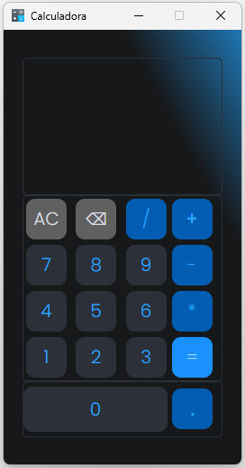

# [Calculadora Electron]

> Descrição do projeto "Um app desktop, desenvolvido em JavaScrip, utilizando o framework electron com o intuito de permitir realizar operações matemáticas básicas como adição, subtração, multiplicação e divisão."

# :pushpin: Sumario deste projeto

- [Título e Imagem de capa](#calculadora-electron)
- [Descrição do Projeto](#calculadora-electron)
- [Badge](#calculadora-electron)
- [Índice](#sumario-deste-projeto)
- [Features](#rocket-features)
- [Encontrou algum bug?](#bug-bugs)
- [Contribuição](#tada-contribuição)
- [Licença](#closed_book-licença)

 

# :rocket: Features

- Esta calculadora possui diversas funcionalidades básicas e avançadas que permitem ao usuário realizar operações matemáticas simples e manipular a entrada de dados de forma eficiente. Abaixo estão detalhadas as principais funcionalidades implementadas:

1.	Entrada de Números:
o	Botões de Números: A calculadora possui botões numerados de 0 a 9 que permitem ao usuário inserir números na expressão atual.
2.	Operações Matemáticas:
o	Adição (+): Permite adicionar números.
o	Subtração (-): Permite subtrair números.
o	Multiplicação (*): Permite multiplicar números.
o	Divisão (/): Permite dividir números.
3.	Manipulação de Expressão:
o	Limpar Display (AC): Limpa a expressão atual e o histórico, reiniciando a calculadora.
o	Apagar Último Caractere (←): Remove o último caractere da expressão atual, permitindo correções rápidas.
4.	Ponto Decimal:
o	Ponto (.): Permite a entrada de números decimais na expressão.
5.	Cálculo do Resultado:
o	Igual (=): Calcula e exibe o resultado da expressão atual. Se a expressão for inválida, exibe um erro.
6.	Histórico:
o	Histórico de Expressões: Exibe a expressão atual e o resultado após a avaliação, permitindo ao usuário ver o cálculo realizado.

# :framed_picture: UI Interface do Usuário

     

# :construction_worker: Guia de instalação

**Voce precisa instalar [Node.js](https://nodejs.org/pt) primeiro, para clonar este repositorio via HTTPS, ronde o comando abaixo:**

`git clone https://github.com/SusanMarques/calculadora-electron.git`

**Instale as dependencias**

Você precisa instalar as dependencias deste projeto, entao **execute o comando abaixo na pasta raiz**:

`npm install`

# :runner: Vamos começar

Execute o seguinte comando para iniciar o app em um ambiente de desenvolvimento:

`npm start`

# :postbox: FAQ

**Pergunta:** Quais tecnologias foram utilizadas neste projeto?

**Resposta:** As tecnologias utilizadas são: [JavaScript](https://developer.mozilla.org/pt-BR/docs/Web/JavaScript), [electron](https://www.electronjs.org/), [HTML](https://developer.mozilla.org/pt-BR/docs/Web/HTML) and [CSS](https://developer.mozilla.org/pt-BR/docs/Web/CSS)

# :bug: Bugs

Sinta-se à vontade para **registrar um novo problema** com o respectivo título e descrição no repositorio [calculadora-electron](https://github.com/SusanMarques/calculadora-electron/issues). Se você já encontrou uma solução para o seu problema, **adoraria revisar sua solicitação de pull request**! Dê uma olhada em nosso **gia de contribuição abaixo**.

# :tada: Contribuição

### Se você quiser contribuir para este projeto, siga estas etapas:

1. Faça um fork do projeto.
2. Crie uma branch para a sua feature `git checkout -b feat/NomeDaSuaFeature`.
3. Faça commit das suas alterações `git commit -am "[add/edit/del]/feat: Descrição da feature"`.
4. Faça push para a branch `git push origin feat/NomeDaSuaFeature`.
5. Crie um novo Pull Request.

# :closed_book: Licença

Lançado em 2024.
Este projeto esta sob a licença [MIT license](https://github.com/NomeDeUsuario/calculadora-electron/master/LICENSE).

